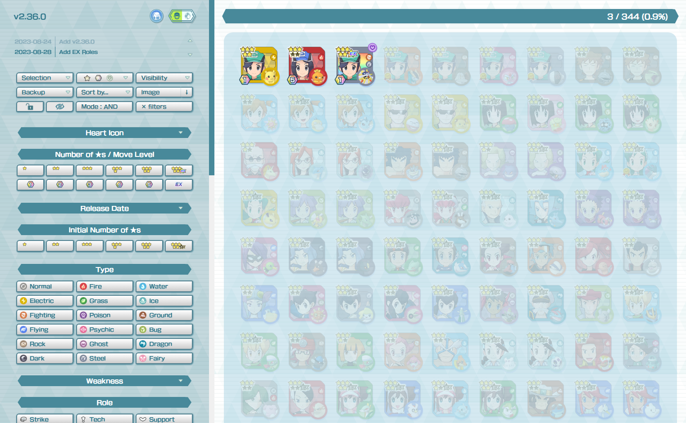

# SyncPairsTracker

This project uses https://html2canvas.hertzen.com/ to create an image of the sync pairs, https://tinysort.sjeiti.com/ for the sorting function and https://github.com/SortableJS/Sortable for the drag-and-drop part.

